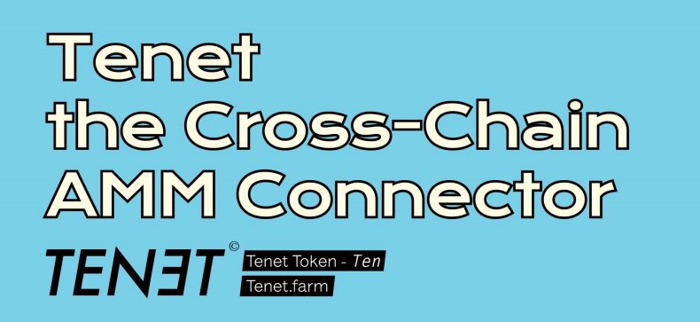

# Tenet Core V2

Tenet V2 smart contracts.

## Overview

Tenet is a cross-chain Automated Market Maker (AMM) connector that provides a decentralized Liquidity Tap for various tokens. The Liquidity Tap is the powerhouse of the Liquidity Pool, which ensures the fair allocation of mining rewards through the optimization of the algorithms of initial mining incentives and LP token pools.

### [Introducing Tenet](https://tenetfarm.medium.com/introducing-tenet-a-defi-layer-2-solution-and-amm-super-connector-55c965027c69)

# Usage

The following assumes the use of `node@>=10`.

## Install Dependencies

`yarn`

## Compile Contracts

`truffle compile`

## Deploy Contracts

`truffle migrate` 

## Run Tests

`truffle test`

## License

This project is licensed under the MIT Public License. See the [LICENSE](LICENSE) file for details.